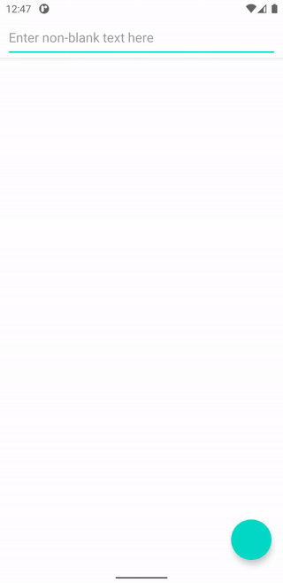
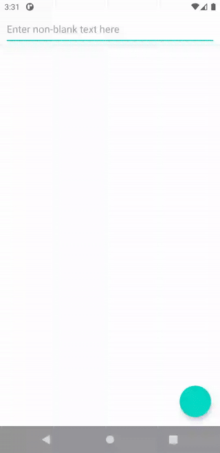
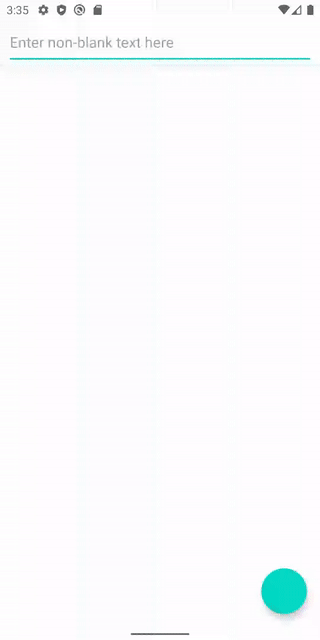
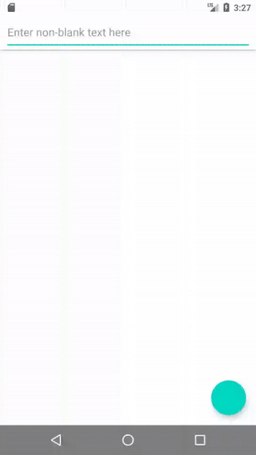
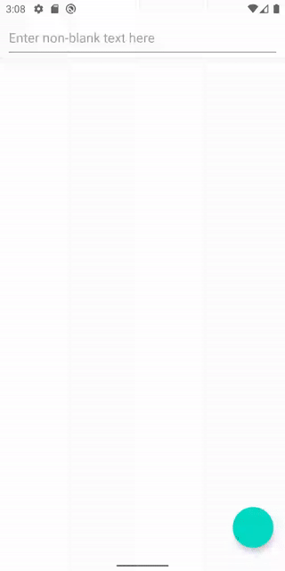
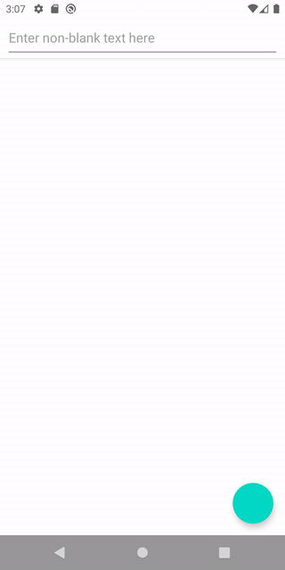
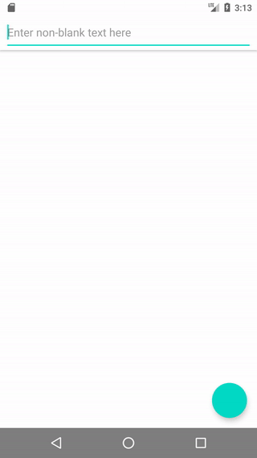

# Android edge2edge

A companion repository for the advanced edge-to-edge series on Medium containing the sample app.

## Keyboard Transitions with `MotionLayout`:

## `BottomSheetDialogFragment`:

